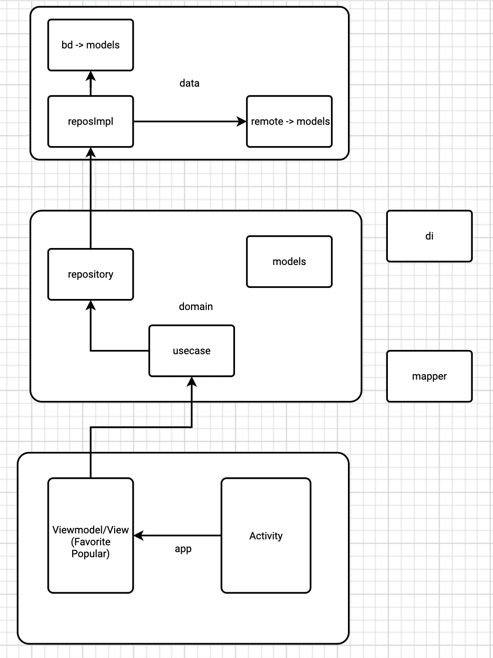

# Проект по практике

Данное приложение разработано в качестве поставленной задачи при прохождении практики по мобильной
разработке в компании "Neoflex".

## Описание

1. Получение данных о валютах с URL https://www.cbr-xml-daily.ru/daily_json.js
2. Обработка данных с сервера и валидация полученной коллекции
3. Отображение списка валют, цену и динамику за последний час
4. Возможность добавить валюту/ы в избранное, путем нажатия на кнопку напротив валюты
5. Отображение только избранных валют
6. Поиск валют
7. Сортировку валют по Алфавиту и по значению (по возрастанию, по убыванию)

## Используемый стек

* Jetpack Compose
* Kotlin
* Navigation component
* StateFlow
* Coroutines
* Room
* Hilt
* Retrofit
Приложение написано с
  соблюдением [Clean Architecture](https://github.com/ImangazalievM/CleanArchitectureManifest/blob/master/README-RU.md)
  и [MVVM](https://en.wikipedia.org/wiki/Model–view–viewmodel) подхода.

## Архитектура приложения

